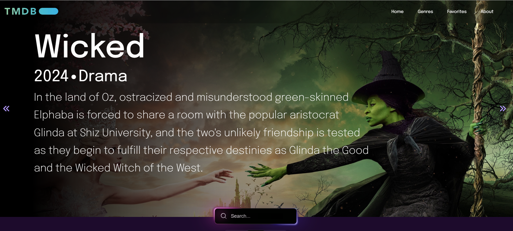
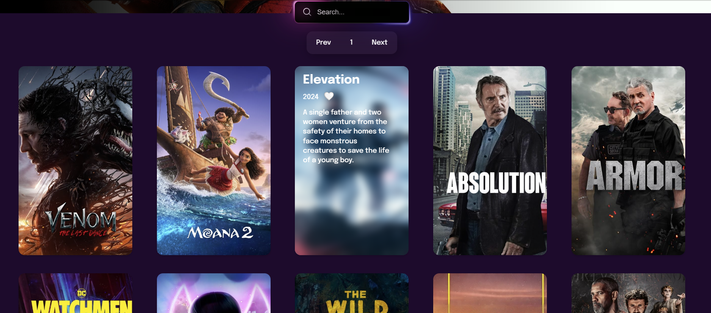
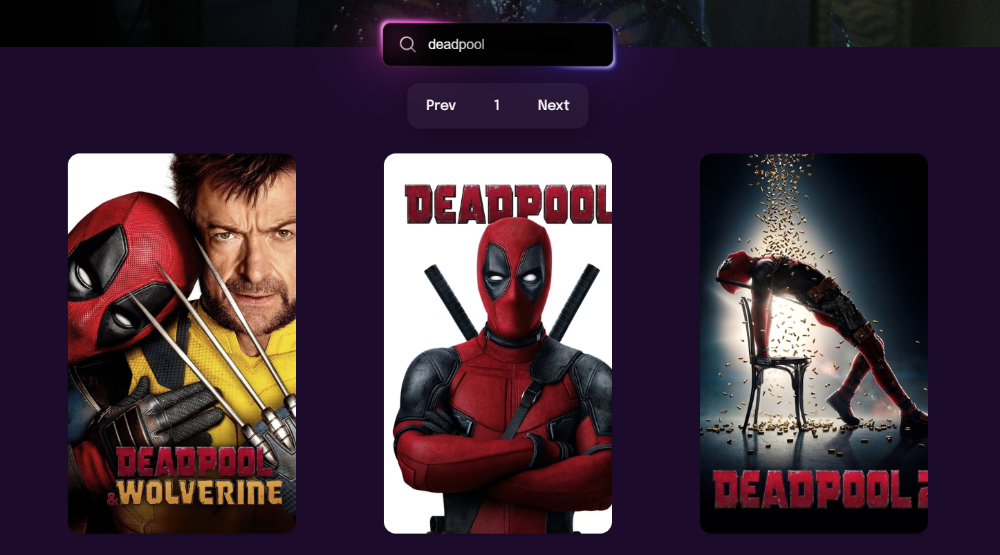
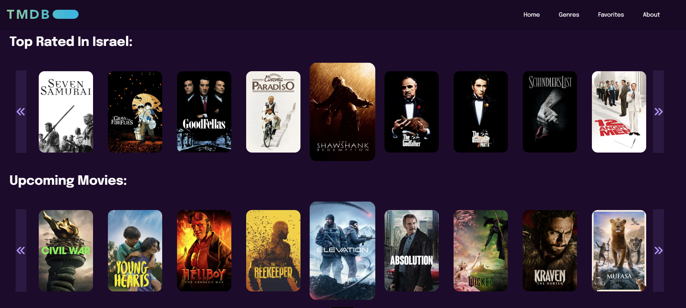
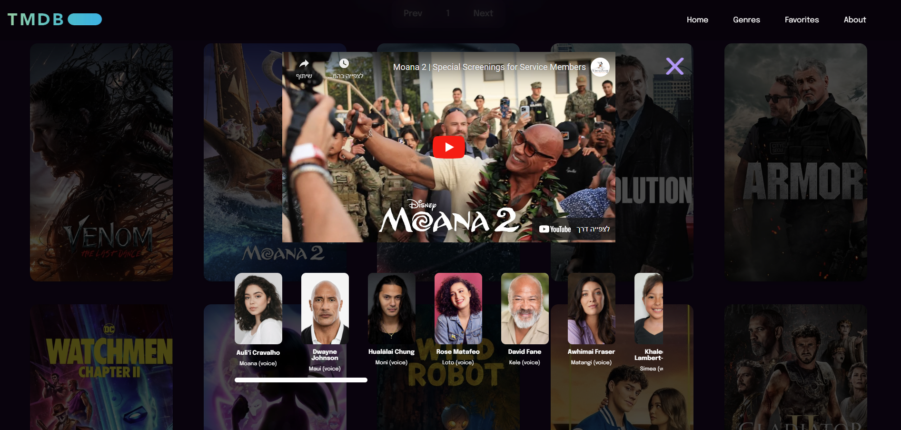
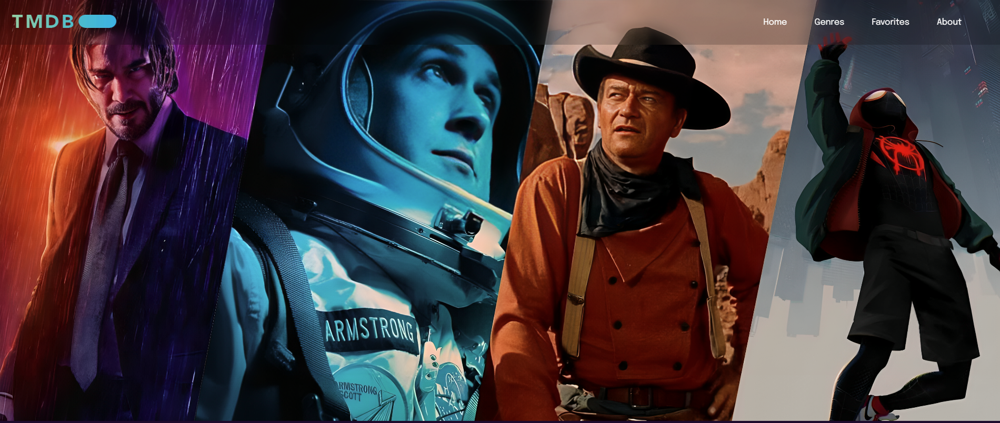
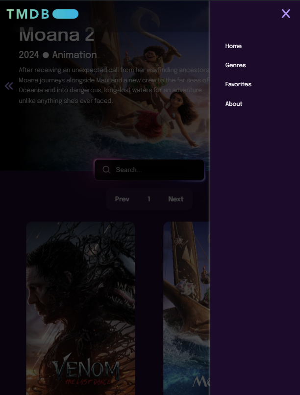
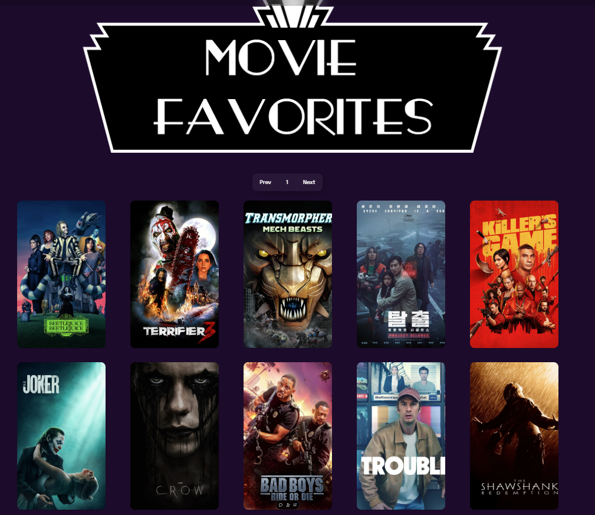

# [TMDB Clone](https://the-movie-db-clone-azmjmjej9-yanivs-projects-d091535c.vercel.app/pages/index.html)

A simple clone of [The Movie Database (TMDB)](https://www.themoviedb.org/) using pure HTML, CSS, and JavaScript. This project allows users to search for movies, view top-rated movies, upcoming releases, and browse movies by genre. Users can like and save movies to their favorites, remove them from their favorites, and see a list of all liked movies. It uses the TMDB API to fetch movie data.

## Features

- **Movie Search**: Search for movies by their title using the TMDB API.
- **Top Rated Movies**: Browse a carousel of top-rated movies in your region.
- **Upcoming Movies**: View a carousel of upcoming movie releases.
- **Browse by Genres**: Explore movies by different genres.
- **Like and Save Favorites**: Users can like movies and save them to their favorites list.
- **View Liked Movies**: Easily access all your liked and favorite movies.
- **Unlike Movies**: Remove movies from your favorites list.

## Gallery:

<table style="width:100%; border-collapse:collapse;">
  <tr>
    <td colspan="2" style="text-align:center;">
        
    </td>
  </tr>
  <tr>
    <td style="text-align:center;">
        
    </td>
    <td style="text-align:center;">
        
    </td>
  </tr>
    <tr>
    <td style="text-align:center;">
        
    </td>
    <td style="text-align:center;">
        
    </td>
  </tr>
    <tr>
    <td style="text-align:center;">
        
    </td>
    <td style="text-align:center;">
        
    </td>
  </tr>
  </tr>
    <tr>
    <td style="text-align:center;">
      
    </td>
    <td style="text-align:center;">
        
    </td>
  </tr>
</table>

## Live Server

A live demo of the project can be found [here](https://the-movie-db-clone-azmjmjej9-yanivs-projects-d091535c.vercel.app/pages/index.html)
